# 3D Gaussian Splatting (a toy implementation)

> **Kerbl, Kopanas, Leimkuhler, Drettakis — “3D Gaussian Splatting for Real-Time Radiance Field Rendering,” SIGGRAPH 2023**

Disclaimer: This repository is created using multiple AI Tools.

This repository contains:
* This README.md
* [2D GS](2DGS_Tutorial.ipynb) - CPU-only (no CUDA) implementation of 2DGS
* [3D GS](3DGS_Tutorial.ipynb) - CPU-only (no CUDA) implementation of 3DGS
* [multi-view data](tiny_nerf_data.npz) - data used for 3D GS ([original link](https://github.com/bmild/nerf/issues/3))

Rest of this README briefly describes 3DGS from implementaion perspective.

## Overview

### The pipeline, end to end

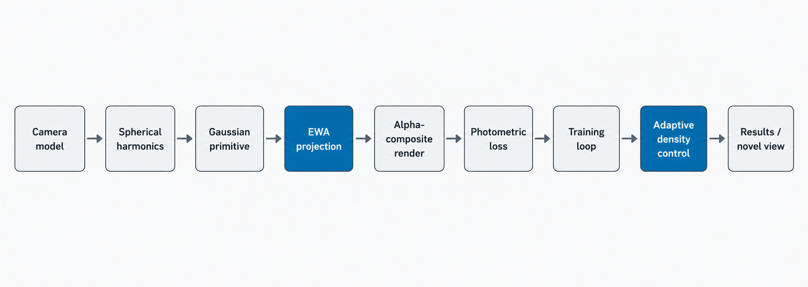

Nine pieces, each building on the last. EWA projection and adaptive density control are the two genuinely novel/hard pieces; most of the deck's depth lives there.

### Why gaussians, not an implicit field

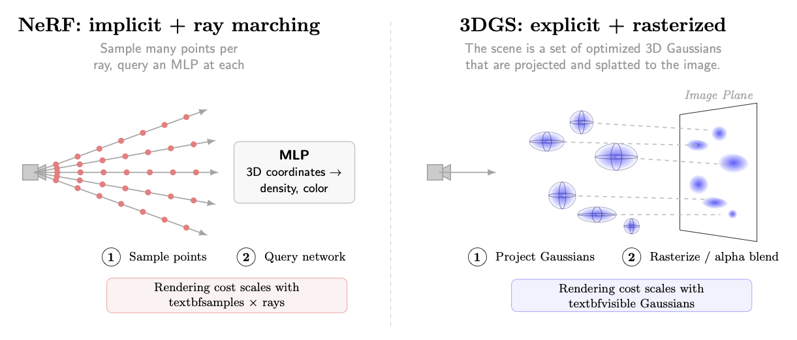

NeRF queries an MLP at many sampled points per ray and integrates the results. 3DGS represents the scene as an explicit list of gaussians and rasterizes them directly, avoiding per-ray MLP evaluation.

## Section 0 · Data

### Setup: the Lego bulldozer scene

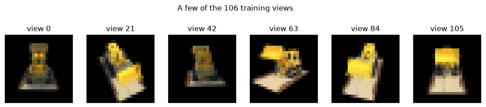

_106 synthetic photos, known ground-truth poses, downsampled from 100×100 to 25×25._

Poses are given rather than COLMAP-recovered so the talk and notebook can focus on the splatting mathematics. Downsampling is a CPU-speed trade-off: rendering cost scales with image size.

## Section 1 · Cameras

### Intrinsics and extrinsics

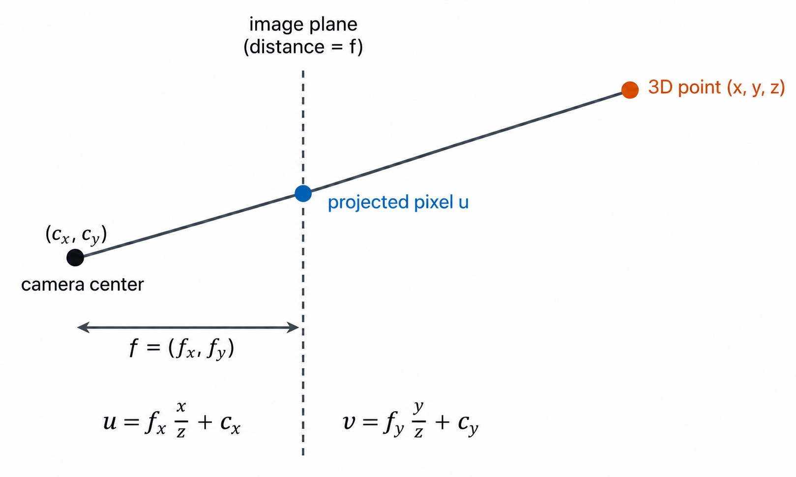

Extrinsics $(R,t)$ place the camera in the world. Intrinsics $(f_x,f_y,c_x,c_y)$ map a camera-space point to a pixel. The focal lengths remain per-camera for generality.

### A convention gotcha

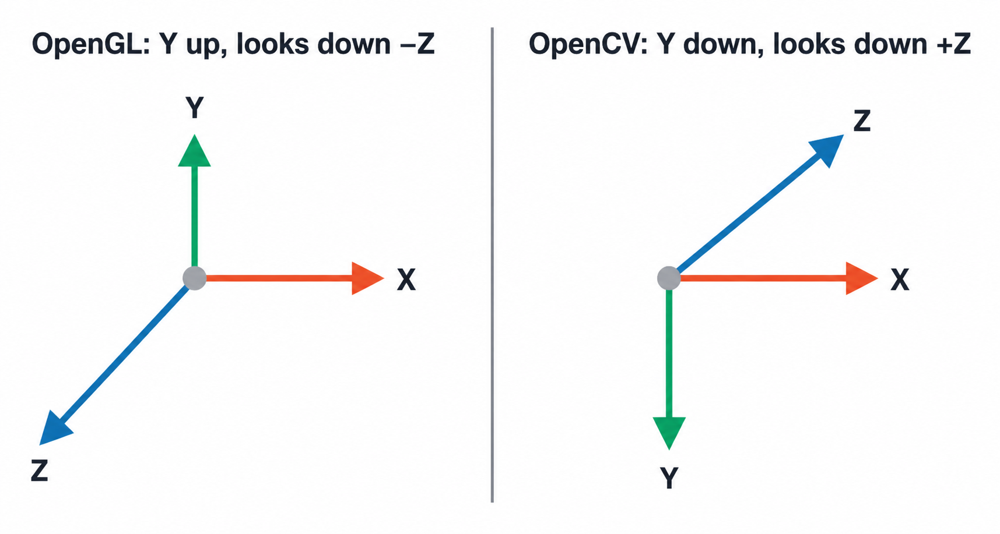

_Dataset poses: OpenGL (Y up, looks down −Z) → converted once to OpenCV (Y down, looks down +Z)._ 

If this conversion is wrong, downstream operations fail silently. Converting once at load time means real COLMAP poses can be substituted later without changing projection or rendering mathematics.

## Section 2 · Spherical harmonics

### View-dependent color

<!--  -->

$color(d) = Σ_{l=0}^{L} Σ_{m=-l}^{l} c_{lm} Y_{lm}(d)$

- Degree 0: a single constant basis function, producing flat, non-view-dependent color.
- Degree $(l)$ has $(2l+1)$ basis functions: 1, 3, 5, and 7 for degrees 0–3, or 16 total through degree 3.
- Higher degrees add angular detail such as specular highlights and view-dependent shading.

Each gaussian carries 16 coefficients per color channel. Degree 0 alone reduces to a flat RGB color, which is the fallback used at the start of training.

### Degree by degree

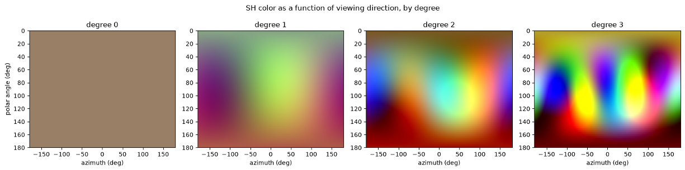

_Same random coefficients evaluated over every viewing direction, from degree 0 through degree 3._

### Why ramp the degree during training

- Training starts at SH degree 0 and increases every approximately 83 iterations.
- The flat/base color is fitted before capacity is spent on view-dependent detail.
- This is a coarse-to-fine curriculum rather than a fixed budget from the first step.

The curriculum is not required by the mathematics, but it stabilizes early training because degree 0 is the easiest signal to fit first.

## Section 3 · Gaussian primitive

### Parameters, and an unconstrained trick

<!--  -->
$Σ = R S Sᵀ Rᵀ$

- A gaussian consists of a mean (position), covariance $(Σ)$, opacity, and spherical-harmonic color coefficients.
- The covariance is factored as rotation × scale × scaleᵀ × rotationᵀ, making it positive semidefinite by construction.
- The optimization uses log-scale, a raw quaternion, and an opacity logit. Gradient descent therefore cannot violate the constraints: `exp()` keeps scale positive, quaternion normalization keeps rotations valid, and `sigmoid()` keeps opacity in `(0, 1)`.

### Starting the population: visual-hull initialization

- The background is exactly black, providing free segmentation without COLMAP.
- Candidate points are oversampled from a cube around the scene.
- Each point is projected into every training photo and retained when it lands on the foreground silhouette in at least 90% of views.
- Each survivor is colored from the photos on which it appears.
- The initial cloud is concentrated on the object rather than the entire capture volume.

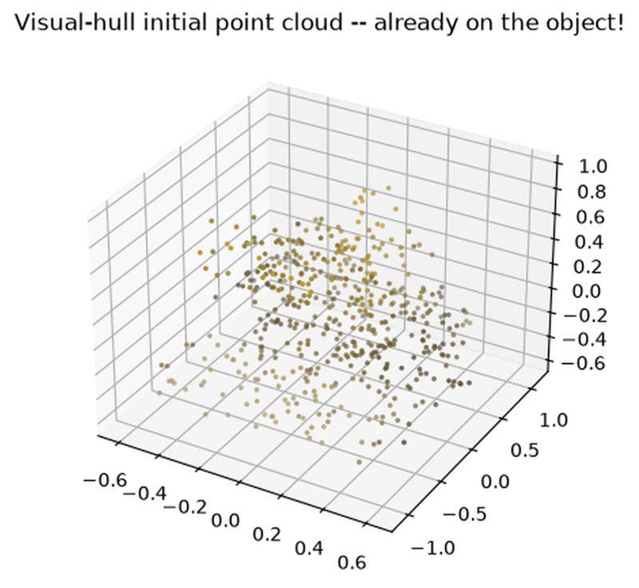

## Section 4 · EWA projection

### The problem: projection is nonlinear

- Each gaussian needs a 2D screen footprint: projected mean and projected covariance.
- Mean projection is an ordinary perspective divide.
- Covariance is harder because `u = fx * x / z + cx` is a ratio of jointly Gaussian quantities, not a linear map.
- Affine maps preserve Gaussianity, but a ratio's Jacobian depends on `z`; it is not constant, so exact Gaussianity breaks.
- The ratio of two independent standard normals is Cauchy rather than Gaussian.

### The fix: linearize at the mean

<!--  -->

$Σ' = J Σ_{cam} Jᵀ$

- `J` is the Jacobian of perspective projection evaluated at the gaussian's own camera-space mean.
- `Σ_cam = R Σ_world Rᵀ` is exact because rotation is linear.
- An affine map built from `J` preserves Gaussianity exactly, approximating the true projection locally.
- The approximation is accurate when the gaussian is small relative to its distance from the camera.

This is the central formula of the deck: each gaussian gets its own local linearization, so the approximation only needs to hold across that gaussian's extent.

### Where the approximation holds—and breaks

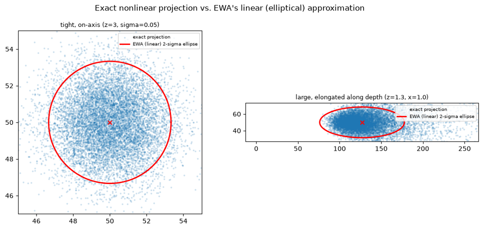

_Left: tight, on-axis gaussian; exact projection nearly matches EWA. Right: large, depth-elongated gaussian; visible mismatch._

### A closed-form sanity check

<!--  -->
$Σ_{2d} = scale^2 (\frac{f}{z})^2 I + dilation I$

- For an isotropic gaussian on-axis with an identity camera, the projection lands exactly at the principal point.
- At `x = y = 0`, the off-diagonal Jacobian terms vanish.
- The linearization introduces zero error in this hand-checkable special case.

### One practical addition: the dilation floor

- Add `dilation * I` to every projected covariance, with `dilation = 0.3` in this notebook.
- This ensures even tiny or extremely thin gaussians cover approximately one pixel.
- Without it, gaussians can vanish between pixel samples, causing aliasing.
- This is an anti-aliasing addition rather than part of EWA theory itself.

## Section 5 · Rasterization

### Alpha compositing, near to far

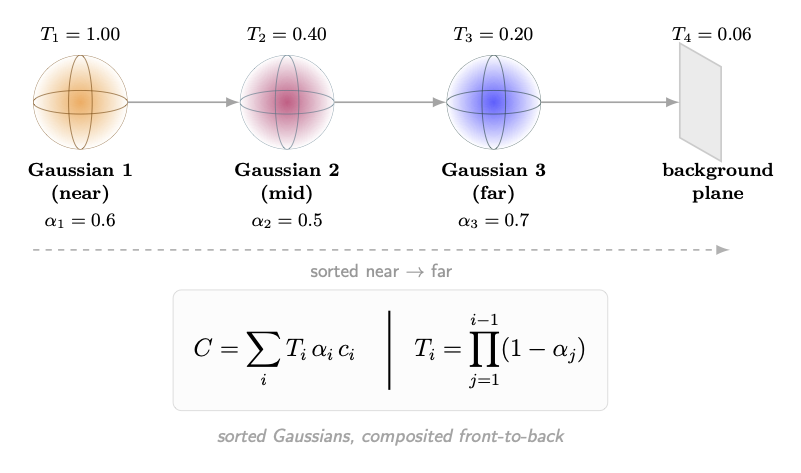

Use Porter–Duff “over” compositing in near-to-far order. This is the same compositing logic used by a tile-based CUDA rasterizer; the notebook implements it one gaussian at a time in plain PyTorch for CPU-friendly simplicity.

### Where the color comes from

- Color is not a fixed per-gaussian RGB value.
- It is evaluated from SH coefficients in the direction from the gaussian to the current camera.
- The same gaussian can render a different color from different viewpoints.
- This connects the SH machinery directly to rasterization.

## Section 6 · Photometric loss

### L1 + SSIM

<!--  -->
$L = 0.8 · L_1 + 0.2 · (1 − SSIM)$

- L1 provides a fine pixel-wise error metric but ignores local structure.
- SSIM uses windowed local statistics and rewards correct local contrast and structure.
- Their combination, using the paper's weighting, tends to produce sharper results.

## Section 7 · Adaptive density control

### The signal: screen-space gradient

- Track each gaussian's screen-space positional gradient: `d(loss) / d(projected 2D mean)`.
- Accumulate it over several training steps between density-control passes.
- A consistently high gradient indicates that a gaussian is under-reconstructing something.
- That signal drives cloning, splitting, or pruning.

### Clone, split, prune, reset

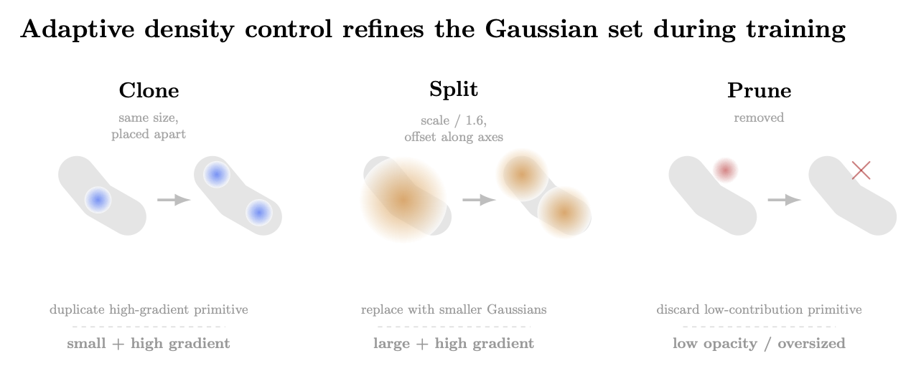

- **Clone:** for small, high-gradient gaussians, duplicate in place and let optimization pull the pair apart.
- **Split:** for large, high-gradient gaussians, replace one with two smaller gaussians, scaling by `1.6` and offsetting along rotation-scaled axes.
- **Prune:** remove low-opacity or oversized gaussians.
- **Reset:** periodically reset opacity so low-utility survivors must re-earn relevance or be pruned.

### The Adam-momentum wrinkle

- Resizing the gaussian population during training is not just tensor resizing.
- Adam stores per-parameter momentum and variance state keyed to each parameter tensor.
- Growing or shrinking the population therefore requires corresponding optimizer-state surgery.
- Incorrect handling silently applies stale momentum to the wrong gaussians.

## Section 8 · Training loop

### Per-parameter-group learning rates

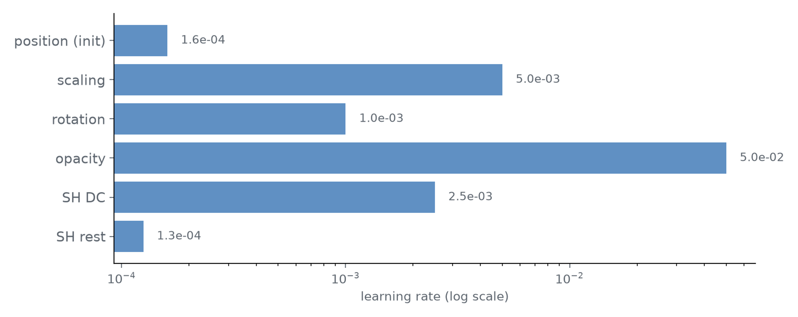

_Position uses its own exponentially decaying, scene-scaled schedule, decaying toward `1.6e-6`._

Opacity has the highest learning rate, while SH-rest has the lowest. Higher-order SH bands change the rendered image less per unit parameter change, so they need a gentler rate for stability.

### Putting it together: the schedule

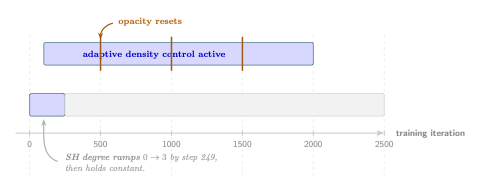

_The notebook's actual schedule: 2,500 iterations._

- SH reaches its full degree within roughly the first 10% of training.
- Density control remains active for 80% of training.
- Opacity resets occur every 500 steps while density control is active.

## Section 9 · Results

### Held-out evaluation

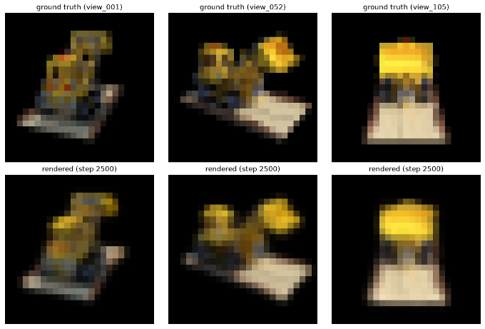

_Ground truth versus rendered views from the training set, shown for comparison._

The real test is held-out L1 on views that were never used for training.

### Novel-view orbit render

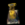

_The orbit uses angles absent from the training set. Its axis, radius, and elevation are estimated from training camera poses rather than assuming a fixed world “up.”_

Native render resolution is 25×25, upscaled for display.

## Section 10 · Extensions

### What's deliberately left out

- Real COLMAP structure-from-motion initialization. Only `random_init_gaussians` would need to change; the remaining pipeline works with any point cloud.
- A tiled/CUDA rasterizer for real-time, million-gaussian scale. The mathematics is the same as Section 5; only the performance engineering changes.

This is a faithful small-scale implementation, not a replacement for the official CUDA renderer.

## Practical lessons

### What building this actually taught us

These findings are empirical engineering results from building and tuning this specific notebook, rather than textbook material.

### Visual-hull initialization: measured, not assumed

- The baseline used uniform-random cube initialization and random colors.
- A training-evolution animation showed most random points landing in empty space and being pruned within a few hundred iterations.
- Visual-hull filtering retained silhouette-consistent candidates and colored them from real photos.
- Across seeds, with all other hyperparameters unchanged:
  - The early-training gaussian-count trough increased from approximately 16 to approximately 330 survivors, about 20×.
  - Held-out test L1 improved by approximately 28%.

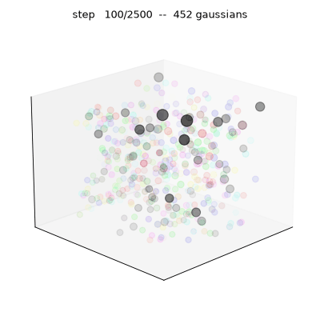

### A chain of compute trade-offs

- `render()` is vectorized without per-gaussian bounding-box crops, simplifying the code but making cost scale with image size.
- Images were downsampled 4×, from 100×100 to 25×25.
- `N_POINTS_INIT = 2000 / DOWNSAMPLE_FACTOR = 500`, tuned across multiple seeds to balance survivor buffer against rendering cost.
- `DENSIFY_UNTIL_ITER` was raised to `0.8 × NUM_ITERS` from the paper's `0.6`. At `0.6`, approximately 21% of final gaussians had near-zero opacity because pruning stopped before late decay was cleaned up.
- Constants were measured across multiple random seeds rather than tuned once and assumed to generalize.

### A close call: `MAX_SCALE_FRAC`

- `densify_and_prune` deletes gaussians larger than `max_scale_frac × scene_extent`.
- Each gaussian starts at scale `extent / N_POINTS_INIT^(1/3)`.
- At the original initialization count, that fraction landed almost exactly on the old fixed prune threshold.
- The first prune pass deleted the entire population simultaneously—a real crash.
- The fix was to derive `max_scale_frac` from `N_POINTS_INIT` with explicit headroom instead of using an independent magic number.

## Appendix

### Additional visualizations

### Final gaussians, viewed from all angles

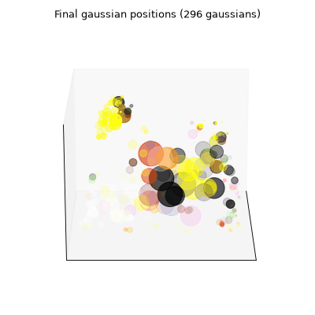

_Marker color is the SH degree-0 base color. Alpha is learned opacity. Size and shape are each gaussian's covariance ellipsoid projected onto the current view, using an orthographic rather than perspective projection._

This shows what the model actually is, rather than only what it renders.

### How the population evolves during training

_Fixed viewpoint: every visible change is a training effect, not camera motion._

The population collapses during the first few hundred steps, then rebuilds through cloning and splitting. This is the older pre-visual-hull behavior that motivated the initialization change.

## Questions?

`3DGS_Tutorial.ipynb` contains the full implementation.

Pipeline recap: camera → SH → gaussian primitive → EWA projection → alpha-composited render → loss → training → density control → results.

---

## Assets

The referenced slide images should be placed in an `assets/` directory beside this Markdown file using the filenames shown in the image links above. The source presentation contained image placeholders, but the uploaded PPTX did not expose the underlying binary asset files through the available file content extraction.
